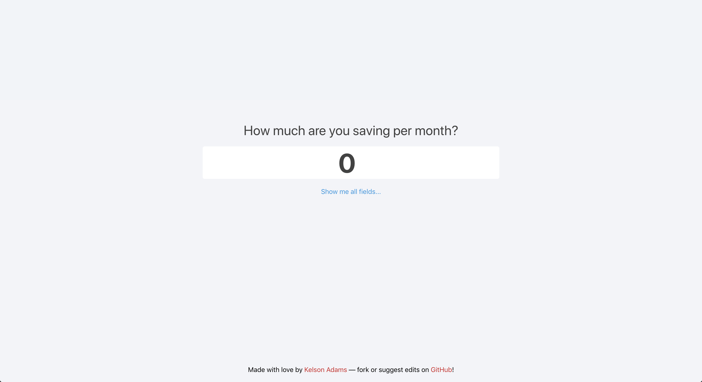
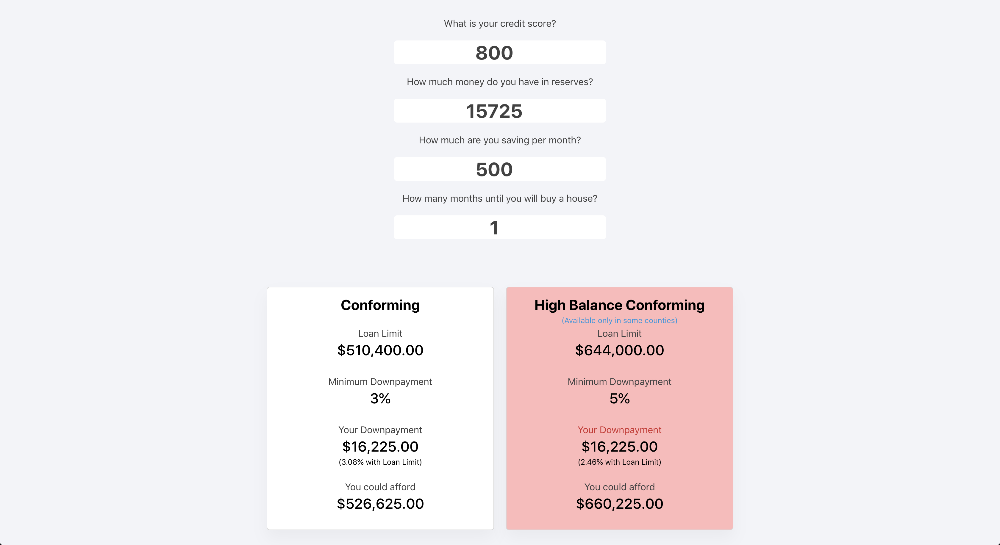

# [The Mortgage Calculator](https://homemortgagecalculate.com/)

[https://homemortgagecalculate.com/](https://homemortgagecalculate.com/)

## Purpose

It can be tough to know how much you can afford when you're in the market for a home. This site attempts to make it very simple.



Just type in how much money you have saved up, how much you're saving per month, and how many months until you want to close.



Then start updating the numbers to get a great idea on what loan is best for you! Have fun and hope it helps!

## Getting Started (locally)

```
git clone git@github.com:kelsonic/the-mortgage-calculator.git

cd the-mortgage-calculator

yarn

yarn start
```

## Contributing

Send up a PR if you're interested in updating the website in any way. It'd be greatly appreciated! 🙏🍻🚀

## License

We use the [MIT License](./LICENSE).
